# Bookshop Application with Web API/Web UI

## Table of contents
* [Table of contents](#table-of-contents)
* [Context](#context)
* [Architecture](#architecture)
  * [Structure](#structure)
  * [API](#api)
  * [UI](#ui)
    * [Products Page](#products-page)
    * [Registration Page](#registration-page)
    * [Login Page](#login-page)
    * [Product Page](#product-page)
    * [Create Product Page](#create-product-page)
    * [Bookings Page](#bookings-page)
    * [Store Items Page](#store-items-page)
    * [Users Page](#users-page)
    * [User Page](#user-page)
* [Installation](#installation)
* [Run](#run)
  * [Script](#script)
  * [Main Application File](#main-application-file)
* [Environment Variables](#environment-variables)

## Context

Bookshop Application - Flask application with MVC framework implementation.
Provides REST API with basic CRUD operations for users, products, store items
and bookings via swagger and UI pages.

## Architecture

### Structure

Bookshop Application implemented using Model View Control framework with
additional services and data access object layers.

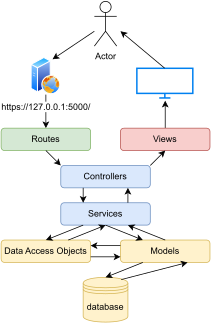

### API

All API documentation is provided on the swagger web page, which is available
after the application is launched.

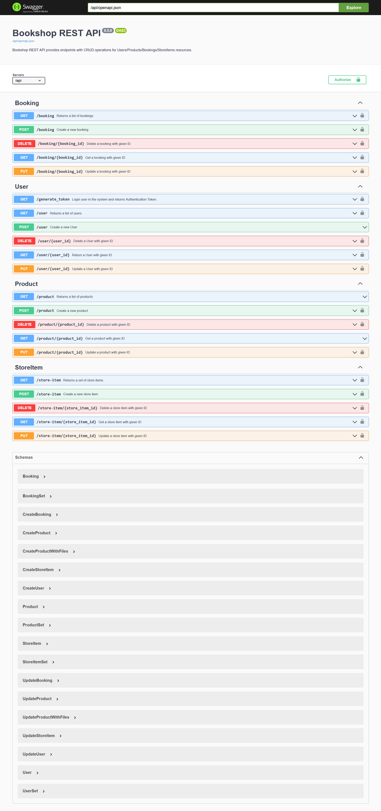

### UI

#### Products page

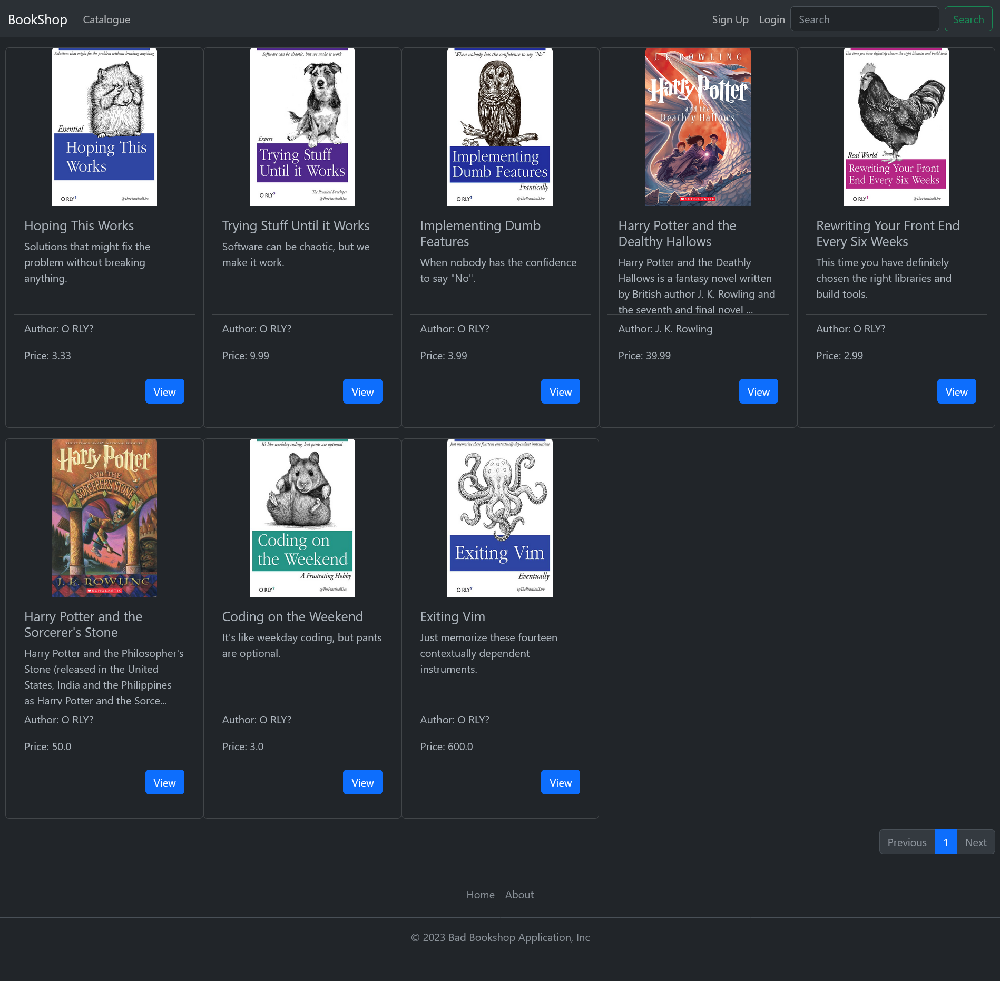

#### Registration page

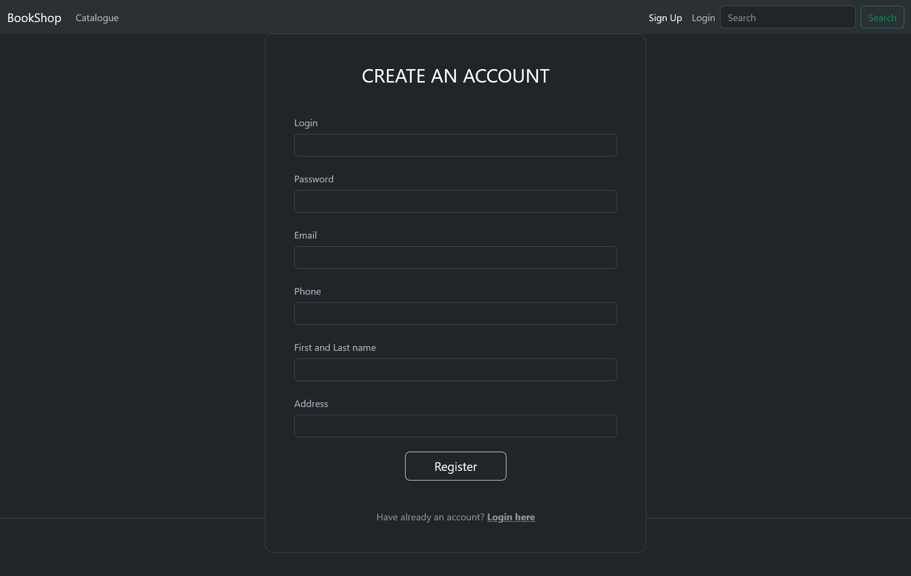


#### Login page

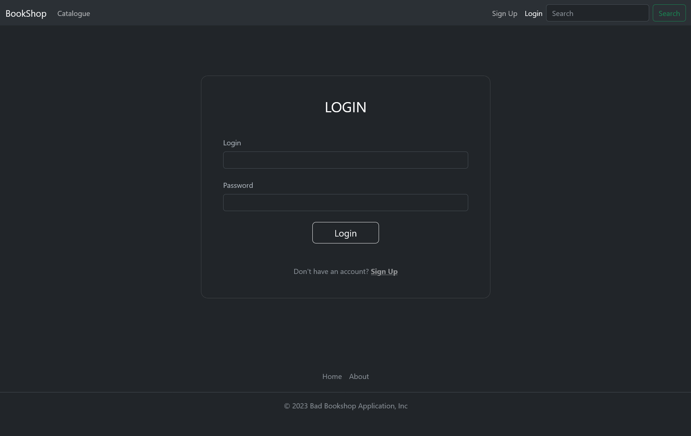


#### Product page

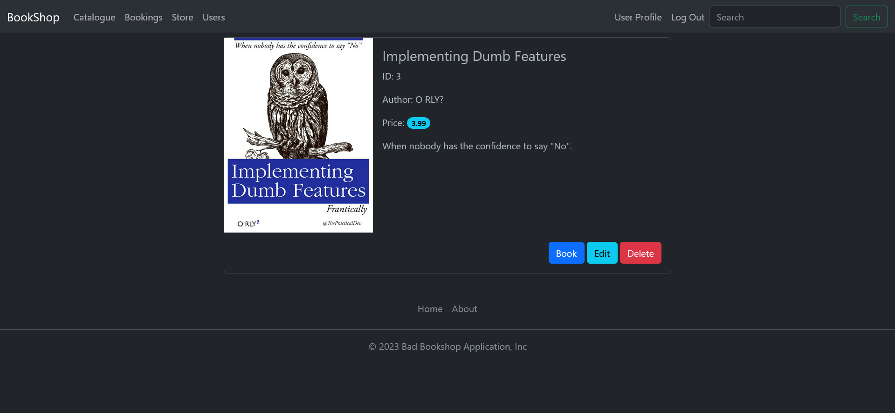


#### Create product page

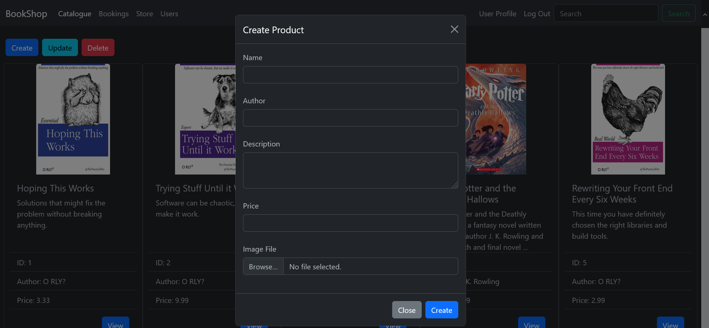


#### Bookings page

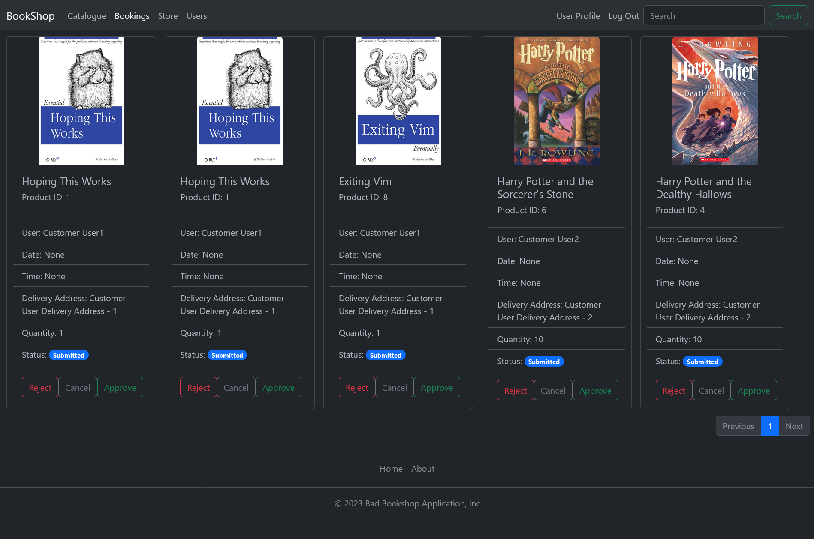


#### Store items page

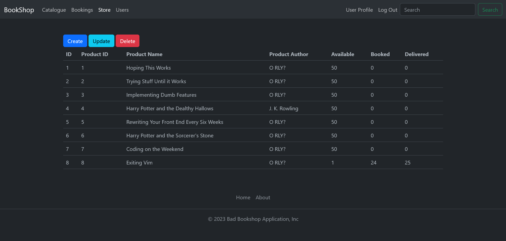


#### Users page

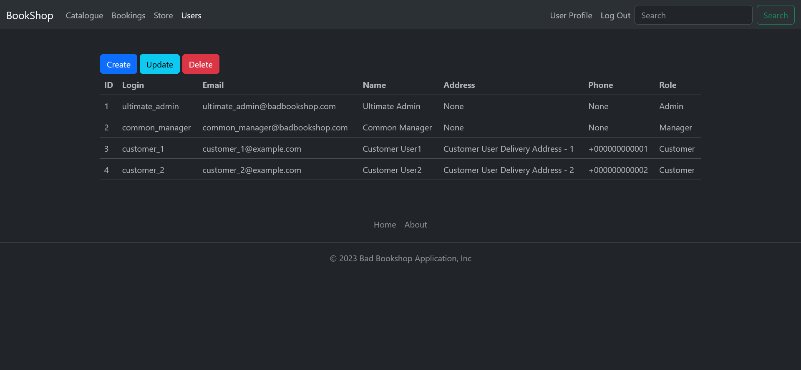


#### User page

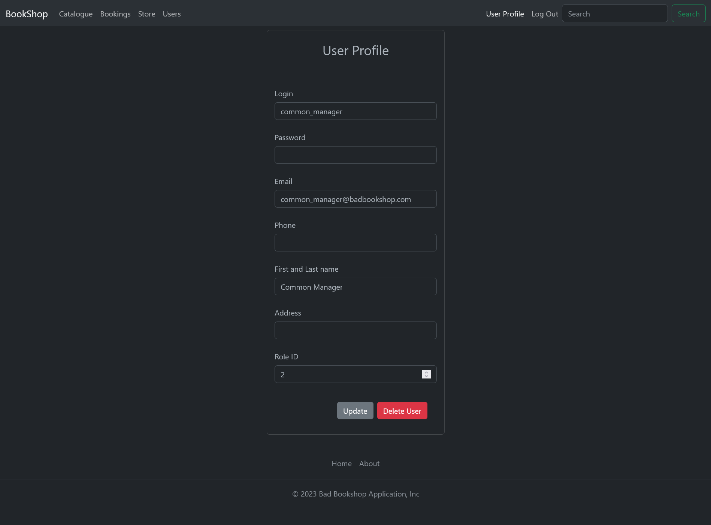


## Installation

To install the application, follow next steps:
1) Clone Bookshop repository:
```shell
***REMOVED***
```
2) Switch to the cloned repository, application part:
```shell
cd bookshop/application
```
3) Create python virtual environment using python with version >= 3.11
```shell
python3.11 -m venv venv
```
4) Activate installed virtual environment
```shell
source venv/bin/activate
```
5) Install application dependencies using [requirements.txt](requirements.txt):
```shell
pip install --requirement --no-deps requirement.txt
```
6) Install application [pyproject.toml](pyproject.toml):
```shell
pip install --no-deps .
```
_Note: To install dev version for contributing please use
`pip install --requirement --no-deps dev-requirement.txt` and then
`pip install --no-deps ".[dev]"`_

## Run

There are two ways to launch application:
1) Via installed in the virtual environment script `run_bookshop_app`
2) Via main application file

All launch types must run in the activated Python virtual environment with the
application dependencies and application installed.

### Script

To run Flask application via script, enter command: <br/>

```shell
run_bookshop_app
```

### Main Application File

To run Flask application via main application file, follow next steps: <br/>
1) Switch to [bookshop application folder](bookshop_app)
```shell
cd bookshop_app
```
2) Run flask command:
```shell
flask run
```

All listed launches launch the application in the default, `DEVELOPMENT`, environment.
To control this behavior use [environment variables](#environment-variables)<br/>

Swagger UI - http://127.0.0.1:5000/api/ui/ <br/>
Application UI - http://127.0.0.1:5000

## Environment Variables

- `ENV` - environment type. Application will select the specific configuration for the every specific environment. <br/>
Available: [`DEVELOPMENT`, `TESTING`, `PRODUCTION`]. All environment configs listed in file [config.py](bookshop_app/config.py)
