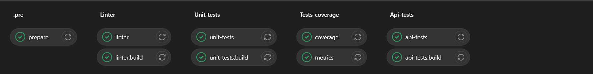
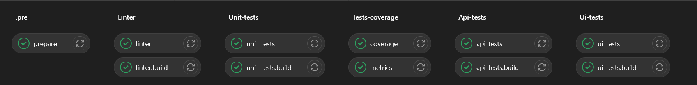

# Bookshop CICD

## Table of contents
* [Table of contents](#table-of-contents)
* [Context](#context)
* [Quality Gates](#quality-gates)
  * [Linter](#linter)
  * [Tests Coverage](#tests-coverage)
  * [Unit Tests](#unit-tests)
  * [API Tests](#api-tests)
  * [UI Tests](#ui-tests)
* [Pipelines](#pipelines)
  * [Build](#build)
  * [Testing](#testing)
  * [Regression](#regression)

## Context

CICD folder contains gitlab cicd files to run various quality gates during development and integration.

## Quality Gates

### Linter

Run pylint for application code. Check if the pylint score is **over 9/10**.

### Tests Coverage

Collect unit tests coverage metric from unit-tests run. Checks if the unit
tests coverage for application is **over 75%**.

### Unit Tests

Run unit tests. Checks if there are **no failed unit tests**.

### API Tests

Run application and API tests. Checks if there are **no failed API tests**.

### UI Tests

Run application and UI tests. Checks if there are **no failed UI tests**.

## Pipelines

### Build

**Quality Gates:**
- [Linter](#linter)
- [Unit-Tests](#unit-tests)
- [Tests-Coverage](#tests-coverage)

**Triggers:** 
Run the pipeline if the merge request for **main** branch has been updated.

### Testing

**Quality Gates:**
- [Linter](#linter)
- [Unit-Tests](#unit-tests)
- [Tests-Coverage](#tests-coverage)
- [Api-tests](#api-tests)

**Triggers:** 
Run the pipeline if the merge request for **production** branch has been updated.

### Regression

**Quality Gates:**
- [Linter](#linter)
- [Unit-Tests](#unit-tests)
- [Tests-Coverage](#tests-coverage)
- [Api-tests](#api-tests)
- [Ui-tests](#ui-tests)

**Triggers:** 
Run the pipeline every day on a schedule for **production** branch.
